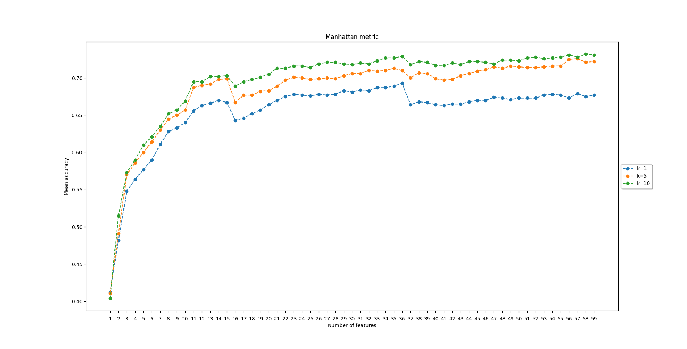
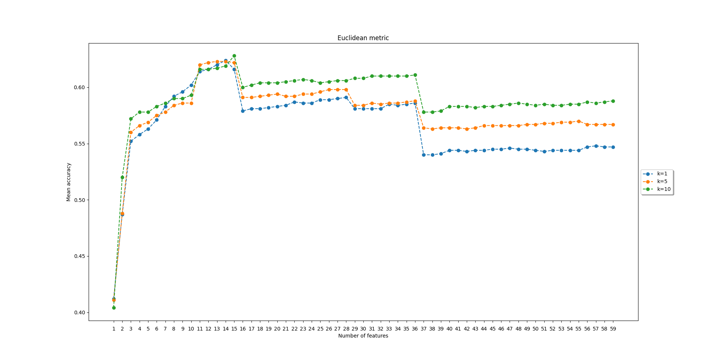
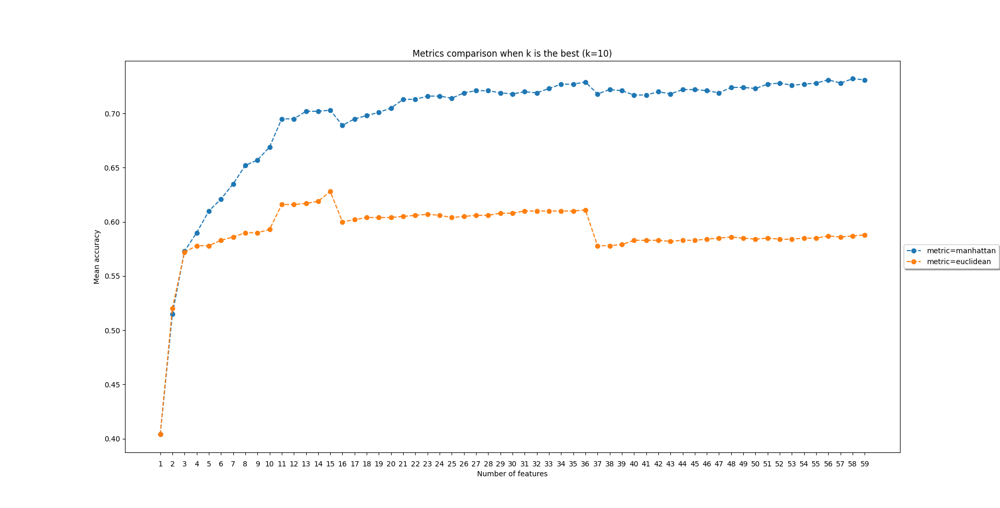

# Myocardial Infraction Diagnosis using k-nearest neighbors algorithm (k-NN)

## Authors

- [Mariusz Wiśniewski](https://github.com/Nexer8)
- [Aleksandra Ziobrowska](https://github.com/olaziobrowska)

## Problem Description

The medical problem we are undertaking is the use of artificial intelligence methods (***k-NN*** algorithm) to aid in the diagnosis of heart attacks in patients. Training data on the patient's medical profile will be used to create the solution. On the basis of the data, the program will link the symptoms and the patient's profile with heart disease or inform about the inability to link the symptoms with its cause, which means that the undertaken medical problem is a problem of multi-class classification.

## About the Dataset

Heart related diseases will be classified on the basis of the traits in the training data concerning the patient's medical history and health condition. The aggregate dataset contains five classes and a total of 901 records. As part of the data set preprocessing, some features will be omitted based on the feature ranking (utilizing the ***chi-squared test***). As part of the optimization of the created model, the hyperparameter tuning for parameters characteristic for the ***k-NN*** classifier will be applied.

### Data Distribution

The classes (diagnoses) and their numbers (equivalent to the number of patients) are presented below. All classes are linked to heart disease.

- Pain of non-heart origin - 230
- Angina pectoris - 142
- Angina pectoris (Prinzmetal variant) - 68
- Myocardial infraction (transmural) - 263
- Myocardial infraction (subendocardial) - 198

## Experiments

- Evaluation of the used classifier using the 5-times repeated method of 2-fold cross-validation.
- Measuring the quality of classification by the frequency of correct diagnoses on the testing set.
- Use of 3 different *k* values: 1, 5 and 10.
- Use of 2 different distance measures: *Manhattan* and *Euclidean*.
- Tests were conducted for a varying number of features, beginning with one - the best according to the calculated ranking - and then increasing one by one.
- Conducting a statistical analysis of the obtained results.

## Results

The best average accuracy (the highest frequency of correct solutions) obtained from the *k-NN* algorithm is **0.732**. It was obtained for a model with the following parameters:

- metric: *Manhattan*,
- number of neighbors: 10,
- number of features: 58.

### Manhattan Metric

|  |
|:--:|
| Plot of the frequency of correct diagnoses depending on the number of features for the *Manhattan* distance metric. |

### Euclidean Metric

|  |
|:--:|
| Plot of the frequency of correct diagnoses depending on the number of features for the *Euclidean* distance metric. |

### Metrics Comparison

|  |
|:--:|
| Plot of the frequency of correct diagnoses depending on the number of features comparing the best selection of the number of neighbors for *Manhattan* and *Euclidean* metrics. |

### High Scores Ranking Report

|                                        | precision | recall | f1-score |
|----------------------------------------|-----------|--------|----------|
| Angina prectoris                       | 0.69      | 0.56   | 0.62     |
| Angina prectoris - Prinzmetal variant  | 0.07      | 0.29   | 0.11     |
| Myocardial infraction (subendocardial) | 0.52      | 0.79   | 0.63     |
| Myocardial infraction (transmural)     | 0.91      | 0.72   | 0.80     |
| Pain of non-heart origin               | 0.93      | 0.87   | 0.90     |

## Remarks

The [Manhattan](#manhattan-metric) and [Euclidean](#euclidean-metric) plots show how the frequency of correct diagnoses changed depending on the number of features and the value of the *k-NN* algorithm parameter for individual metrics.

For both the Euclidean and Manhattan metrics, the highest accuracy was found for the value of the parameter *k* (the number of neighbors) equal to 10. Moreover, in both cases the lowest accuracy occurred for *k* equal to 1, and the results for *k* equal to 5 were between the results for the aforementioned values. Both these figures allow us to conclude that for the data set used, the greater the value of *k* meant a greater frequency of correct solutions to the algorithm.

On the [Euclidean plot](#euclidean-metric) it can be seen that for the Euclidean metric, regardless of the value of *k*, the accuracy of diagnoses increased to a certain number of features (14), and then it began to gradually and successively decrease. This relationship, however, is not true for the Manhattan metric ([Manhattan plot](#manhattan-metric)). It can be observed that the selected metric copes very well with a larger number of dimensions, as the best result obtained with its use occurred for 58 features.

The full report is available in Polish in `raport.pdf`.
